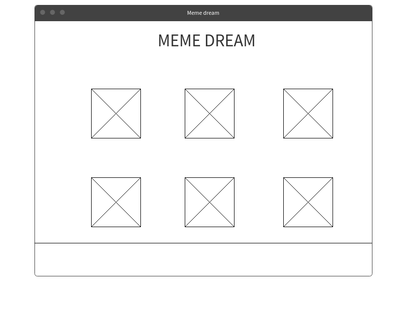
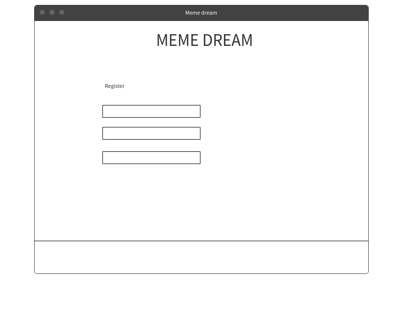
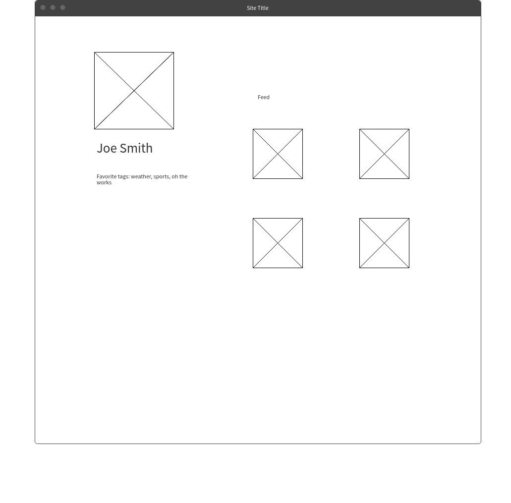
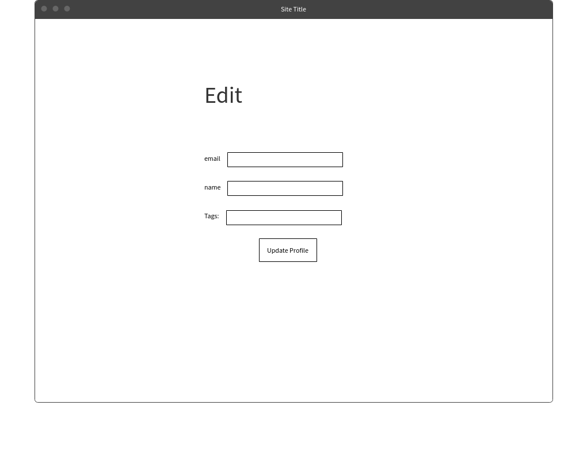
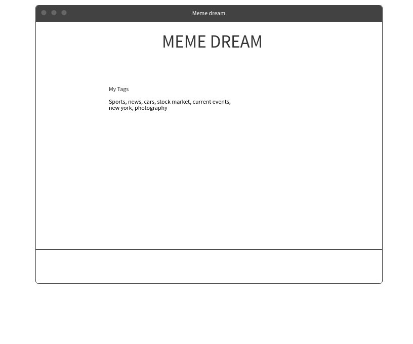
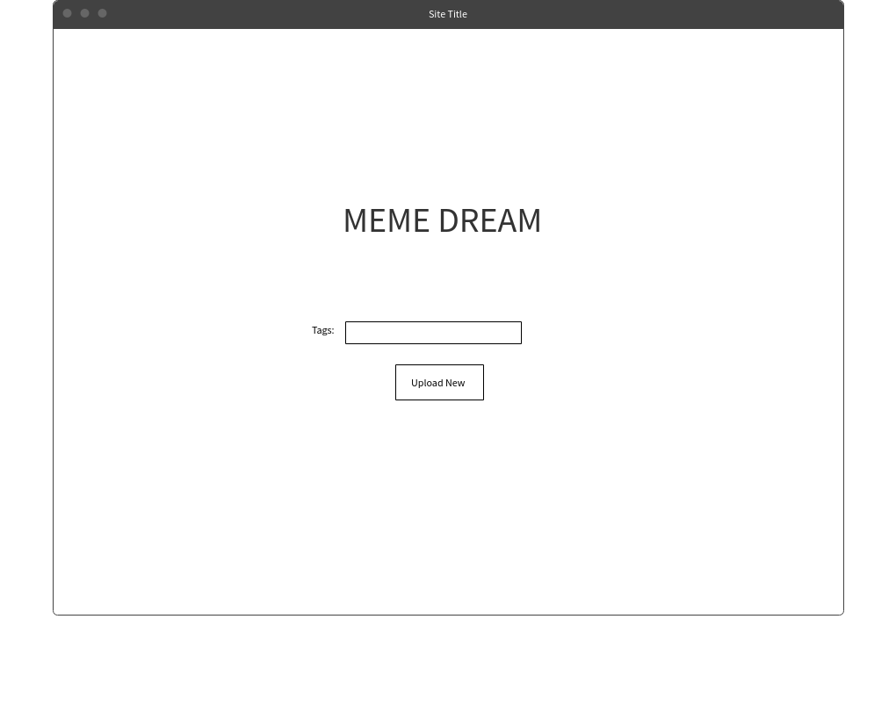
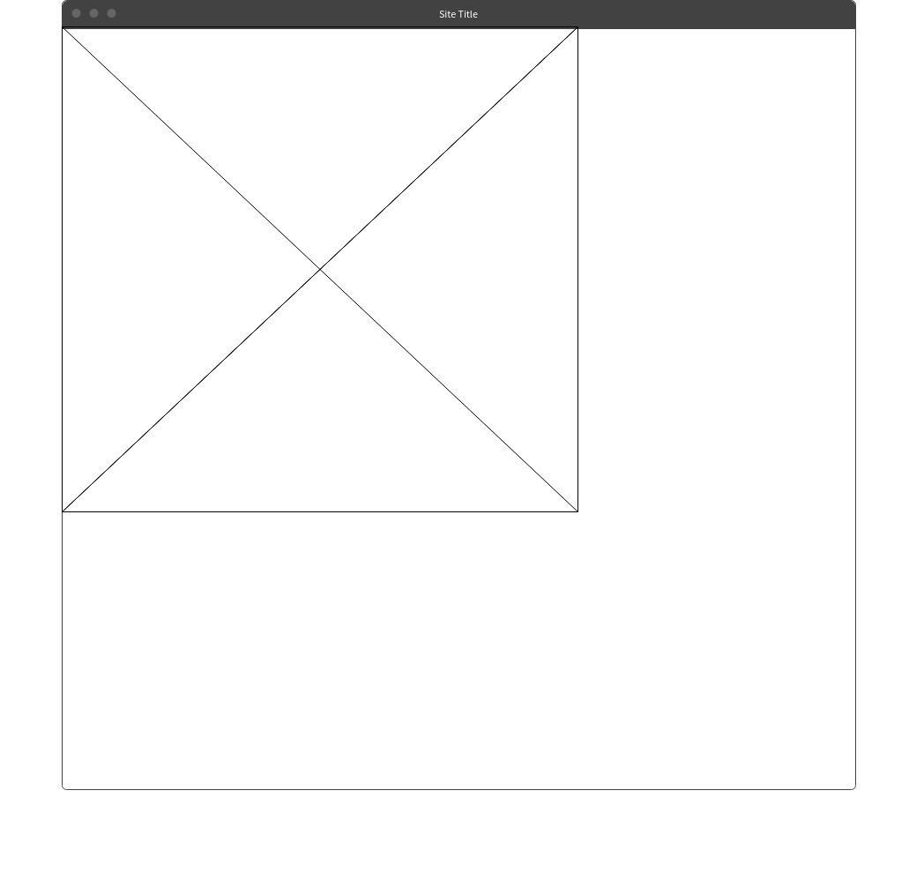
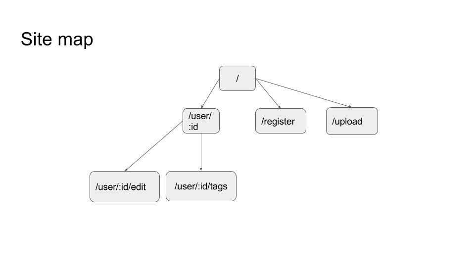

# Meme dream

## Overview

Ever wanted to catch with friends and find more relevant memes they have posted? Trying to find Rock and Morty gifs for your facebook or slack chat?

Meme dream is a infinite-scrolling visualization / tumblr-influenced site where users can search for tags, view other popular tags and (possibly) vote on images. Each user will have unique feeds.

## Usage:

`mkdir uploads && npm run dev`

## Data Model

The application will store Users, Votes and Tags

* users can have multiple lists (via references)
* each list can have multiple items (by embedding)

An Example User:

```javascript
{
  username: "andrew",
  password: //hash;
  votes: [] // array of voted on items;
  tags: [] // list of tags that the user has liked
}
```

An example image
```javascript
{
  name: "Mona Lisa",
  path: '/img/lisa.jpg' // store path;
  votes: 25, // array of voted on items;
  tags: ['art', 'renaissance', 'Da Vinci'] // list of tags that the user has liked
}
```
---
An Example Image with Embedded Item:

```javascript
{
  user: // a reference to a User object
  name: "Breakfast foods",
  items: [
    { name: "pancakes", quantity: "9876", checked: false},
    { name: "ramen", quantity: "2", checked: true},
  ],
  createdAt: // timestamp
}
```
## Goals:

- [ ] Instead of just using express to render pages, use express as an API
endpoint and then use Vue JS to render and display the appropriate content

- [x] Use passport js for authentication
- [ ] Figure out how to do this on one port?? (we're allowed to only use one port on linserv... or host either the client on the server on heroku)

## Extras:

I will add these subgoals if I have time

- [ ] use vuemedium editor to add wysiwyg editor functionality for the profile pages.


## [Link to Commented First Draft Schema](db.js)


## Wireframes

`/` - Anyone can view top trending posts


`/register` - Users can CREATE their profiles



`/user/:id` - Users can view their profiles



`/user/:id/edit` - Users can EDIT their profiles



`/user/:id/tags` - Users can VIEW and EDIT their tags



`/upload` - Anyone can upload their pictures



`/:img` - Images are hosted statically at the root




## Site map



## User Stories or Use Cases

1. as non-registered user, I can register a new account with the site
2. as a non-registered user, I can upload new pictures
3. as a user, I can tag and vote on photos
4. as a user, I can view all of the tags I have in a list
5. as a user, I can edit my current tags for a personalized home page
6. as a user, I can cool off items in an existing grocery list

## Research Topics

* (5 points) Integrate user authentication
    * May use Google OAuth or Facebook OAuth - passport supports these features
    * I'm going to be using passport for user authentication
    * And account has been made for testing; I'll email you the password
    * see <code>cs.nyu.edu/~jversoza/ait-final/register</code> for register page
    * see <code>cs.nyu.edu/~jversoza/ait-final/login</code> for login page
* (5 points) vue.js (maybe)
    * used vue.js as the frontend framework; it's a challenging library to learn, so I've assigned it 5 points, may also use angular as it's good for SPA
    * Milestone 3 - did more research on vue, added `client` folder to the base repo, created
    using the vue-cli app... includes webpack and other frameworks built in.
* (3 points) webpack - may use webpack to babilify -> minify -> uglify or for sass
* (1-3 Points) - May use Imgur API, reddit API, google images API,

10 points total out of 8 required points (___TODO__: addtional points will __not__ count for extra credit_)


## [Link to Initial Main Project File](app.js)


## Annotations / References Used

1. [passport.js authentication docs](http://passportjs.org/docs) - (add link to source code that was based on this)
2. [tutorial on vue.js](https://vuejs.org/v2/guide/) - (add link to source code that was based on this)
3. [tutorial on webpack](https://webpack.js.org/concepts/) - (add link to source code that was based on this)
4. [tutorial on google oauth](https://developers.google.com/identity/protocols/OAuth2)
-- more to come
